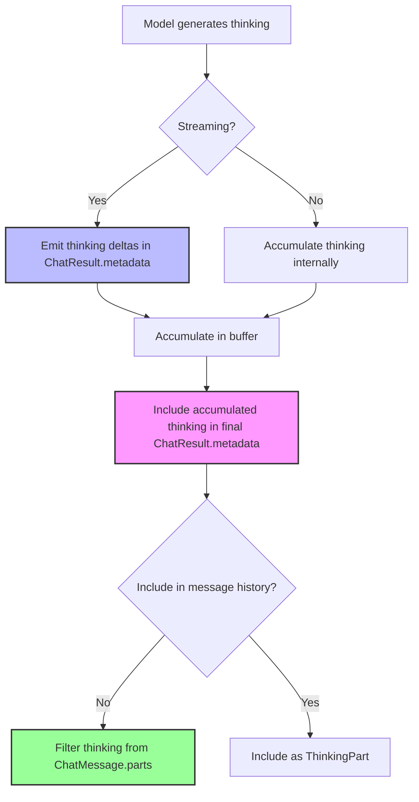
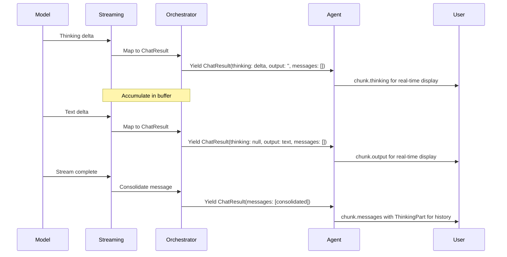

# Thinking (Extended Reasoning) Technical Design

This document describes how Dartantic AI exposes LLM reasoning/thinking capabilities across different providers. "Thinking" or "extended reasoning" refers to models showing their internal reasoning process before providing a final answer.

## Table of Contents
1. [Overview](#overview)
2. [Generic Architecture](#generic-architecture)
3. [Provider Implementations](#provider-implementations)
   - [OpenAI Responses](#openai-responses)
   - [Anthropic](#anthropic)
4. [Usage Patterns](#usage-patterns)
5. [Testing Strategy](#testing-strategy)
6. [Implementation Guidelines](#implementation-guidelines)

## Overview

### What is Thinking?

Thinking (also called "extended reasoning" or "chain-of-thought") is a capability where LLMs expose their internal reasoning process before generating a final response. This provides:

- **Transparency**: See how the model approaches problems
- **Debugging**: Understand why models give certain answers
- **Quality**: Models often produce better answers when "thinking out loud"
- **Education**: Learn problem-solving approaches from the model

### Supported Providers

| Provider | Capability | Status | Configuration |
|----------|-----------|--------|---------------|
| OpenAI Responses | Reasoning Summary | ✅ Implemented | Agent-level `enableThinking` + optional `reasoningSummary` |
| xAI Responses | Reasoning Summary | ✅ Implemented | Agent-level `enableThinking` |
| Anthropic | Extended Thinking | ✅ Implemented | Agent-level `enableThinking` + optional `thinkingBudgetTokens` |
| Google | Extended Thinking | ✅ Implemented | Agent-level `enableThinking` + optional `thinkingBudgetTokens` |
| Others | N/A | ❌ Not supported | - |

## Generic Architecture

### The Thinking Pattern

Dartantic AI follows a consistent pattern for thinking across all providers:



### Core Principles

1. **Agent-Level Configuration**: Thinking is enabled via `enableThinking: true` parameter at the Agent constructor level, not in provider-specific options
2. **Dedicated Surface**: Thinking appears as `ThinkingPart` instances in message parts (v3.0.0+)
3. **Streaming Transparency**: During streaming, thinking deltas are emitted as `ThinkingPart` messages for real-time display
4. **Consolidation**: Multiple streaming `ThinkingPart`s are consolidated into a SINGLE `ThinkingPart` in the final message (same as `TextPart` consolidation)
5. **History Isolation**: Thinking is typically NOT sent back to the model in conversation history
   - **Exception**: Anthropic requires thinking blocks (with signatures) to be preserved when tool calls are present
   - This is handled transparently by the provider implementation via `_anthropic_thinking_signature` metadata
   - Users pay for thinking tokens on every turn when using tools with Anthropic
6. **Provider-Specific Fine-Tuning**: Options classes (e.g., `AnthropicChatOptions`, `GoogleChatModelOptions`) contain only provider-specific tuning parameters like token budgets, not the enable flag
7. **Provider Agnostic**: Same consumption pattern works across all providers

### Message Consolidation Architecture

ThinkingPart consolidation follows the exact same pattern as TextPart consolidation via `MessageAccumulator`:

**During streaming (`MessageAccumulator.accumulate`):**
- Each streaming chunk adds its parts to the accumulated message
- ThinkingParts and TextParts are collected separately

**At end of stream (`MessageAccumulator.consolidate`):**
- All TextParts are joined into a SINGLE TextPart
- All ThinkingParts are joined into a SINGLE ThinkingPart
- Parts are ordered: TextPart first, then ThinkingPart, then other parts (ToolParts, etc.)

**Invariants (enforced by tests in `thinking_consolidation_test.dart`):**
- Final message has at most ONE TextPart
- Final message has at most ONE ThinkingPart
- TextPart comes before ThinkingPart in parts list
- Streaming-only ThinkingPart messages are filtered by `AgentResponseAccumulator`

### Streaming Data Flow



### Key Differences from Message Content

| Aspect | Message Content | Thinking Content |
|--------|----------------|------------------|
| Streaming Access | `chunk.output` (String) | `chunk.thinking` (String?) |
| Final Location | `ChatMessage.parts` (TextPart) | `ChatMessage.parts` (ThinkingPart) |
| Sent to Model | ✅ Yes | ❌ No (by default) |
| Purpose | Conversation content | Transparency/debugging |
| Consolidation | Multiple TextParts → 1 TextPart | Multiple ThinkingParts → 1 ThinkingPart |
| History | Persists | Optional (usually filtered) |

## Provider Implementations

### OpenAI Responses

OpenAI's Responses API supports reasoning through the `reasoning` parameter and exposes it via streaming events.

#### Configuration

```dart
import 'package:dartantic_ai/dartantic_ai.dart';

// Simple configuration - enable thinking with default settings
final agent = Agent(
  'openai-responses:gpt-5',
  enableThinking: true,  // Automatically uses reasoningSummary: detailed
);

// Advanced configuration - customize reasoning options
final agentAdvanced = Agent(
  'openai-responses:gpt-5',
  enableThinking: true,
  chatModelOptions: const OpenAIResponsesChatModelOptions(
    reasoningSummary: OpenAIReasoningSummary.brief,  // Override default
    reasoningEffort: OpenAIReasoningEffort.high,
  ),
);
```

#### Reasoning Summary Options

```dart
enum OpenAIReasoningSummary {
  /// Brief reasoning summary (fastest)
  brief,

  /// Detailed reasoning summary (more comprehensive)
  detailed,

  /// Provider decides the verbosity level
  auto,
}
```

#### Implementation Details

**Streaming Events**: `ResponseReasoningSummaryTextDelta`

```dart
// In ReasoningEventHandler
Stream<ChatResult<ChatMessage>> _handleReasoningSummaryDelta(
  openai.ResponseReasoningSummaryTextDelta event,
  EventMappingState state,
) async* {
  // Accumulate in buffer
  state.thinkingBuffer.write(event.delta);

  // Emit as thinking chunk
  yield ChatResult<ChatMessage>(
    output: const ChatMessage(role: ChatMessageRole.model, parts: []),
    messages: const [],
    thinking: event.delta,
    usage: null,
  );
}
```

**Final Result**: Thinking accumulated as `ThinkingPart` instances in message parts.

**Token Accounting**:
- OpenAI charges for full reasoning tokens generated
- Reasoning tokens reported separately in usage
- Token budget controlled by model, not user-configurable

**Signature**: No cryptographic signature provided

**Implementation Note**: Unlike Anthropic and Google, OpenAI Responses does not store the `enableThinking` flag in the ChatModel. Instead, the Provider merges thinking configuration into the options object before creating the ChatModel. This allows for more granular control through the options-based reasoning configuration.

#### Message Handling

```dart
// Thinking is NOT included in message parts
final message = ChatMessage(
  role: ChatMessageRole.model,
  parts: [
    TextPart(text: finalAnswer),  // Only the answer, not the thinking
  ],
);

// Thinking available in result metadata
final result = ChatResult(
  output: message,
  messages: [message],
  metadata: {
    'thinking': accumulatedThinkingText,  // Full reasoning
  },
);
```

### Anthropic

Anthropic's Messages API supports extended thinking through the `thinking` parameter with explicit token budget control.

#### Configuration

```dart
import 'package:dartantic_ai/dartantic_ai.dart';

// Simple configuration - enable thinking with default budget (4096 tokens)
final agent = Agent(
  'anthropic:claude-sonnet-4-5',
  enableThinking: true,
);

// Advanced configuration - customize token budget
final agentCustomBudget = Agent(
  'anthropic:claude-sonnet-4-5',
  enableThinking: true,
  chatModelOptions: const AnthropicChatOptions(
    thinkingBudgetTokens: 8192,  // Optional: override default budget
  ),
);
```

#### Implementation Details

**SDK Support**: `anthropic_sdk_dart` v0.3.0+ includes full thinking support

**Content Blocks**: Anthropic includes thinking as `Block.thinking()` in message content:

```dart
// Anthropic's native format includes thinking in content
Block.thinking(
  type: ThinkingBlockType.thinking,
  thinking: "Let me think through this step by step...",
  signature: "optional_cryptographic_signature",
  cacheControl: null,
)
```

**Streaming Events**: `BlockDelta.thinking()`

```dart
// In MessageStreamEventTransformer
BlockDelta.thinking(
  thinking: "Step 1: Analyze the problem...",
  type: ThinkingBlockDeltaType.thinkingDelta,
)
```

**Dartantic Mapping Strategy**:

Despite Anthropic including thinking in message content, Dartantic follows the established pattern with one important exception:

1. **During streaming**: Extract thinking deltas and emit as `ThinkingPart` instances
2. **After completion**: Accumulate full thinking in result metadata
3. **In message history**: Thinking blocks are preserved in metadata when tool calls are present

⚠️ **Important**: When a response includes both thinking and tool calls, the thinking block is preserved in the message structure and sent back in subsequent turns. This is required by Anthropic's API to maintain proper context for multi-turn tool usage. Users are charged for these thinking tokens on every turn.

**Implementation Flow**:

The Anthropic message mapper handles thinking through the following high-level flow:

1. **Streaming Phase**:
   - Accumulate thinking deltas in a buffer as `ThinkingBlockDelta` events arrive
   - Emit each delta as `ThinkingPart` for real-time display
   - Capture the cryptographic signature from the `ThinkingBlock.start` event

2. **Completion Phase**:
   - Store accumulated thinking text and signature in message metadata
   - When tool calls are present, preserve the complete thinking block data
   - Filter thinking blocks from message parts for regular (non-tool) responses

3. **History Reconstruction**:
   - When sending messages back to Anthropic, check for thinking block metadata
   - If present and tool calls exist, reconstruct the `Block.thinking()` with original signature
   - Place thinking block before tool_use blocks (required by Anthropic's API)

See `anthropic_message_mappers.dart` for the complete implementation.

**Token Accounting**:
- Thinking tokens count toward `max_tokens` limit
- User charged for full thinking tokens generated (not the summary)
- Explicit budget control via `budgetTokens` parameter
- Minimum budget: 1,024 tokens

**Signature**: Anthropic provides optional cryptographic signature for authenticity verification. Stored in message metadata via `AnthropicThinkingMetadata` with key `_anthropic_thinking_signature` (a string)

**Token Budget Configuration**:
- Default: 4096 tokens
- Optional override via `AnthropicChatOptions.thinkingBudgetTokens`
- Minimum: 1,024 tokens
- Maximum: Less than `maxTokens`
- Anthropic recommends 4k-10k for most tasks, scaling up for complex reasoning

### Google

Google's Gemini API supports extended thinking through the `thinkingConfig` parameter with explicit token budget control and dynamic thinking modes.

#### Configuration

```dart
import 'package:dartantic_ai/dartantic_ai.dart';

// Simple configuration - enable thinking with dynamic budget (model decides)
final agent = Agent(
  'google:gemini-2.5-flash',
  enableThinking: true,
);

// Advanced configuration - customize token budget
final agentCustomBudget = Agent(
  'google:gemini-2.5-flash',
  enableThinking: true,
  chatModelOptions: const GoogleChatModelOptions(
    thinkingBudgetTokens: 8192,  // Optional: override dynamic default
  ),
);

// Explicit dynamic thinking (model decides optimal budget)
final agentDynamic = Agent(
  'google:gemini-2.5-flash',
  enableThinking: true,
  chatModelOptions: const GoogleChatModelOptions(
    thinkingBudgetTokens: -1,  // Explicit dynamic mode
  ),
);
```

#### Implementation Details

**SDK Support**: `google_cloud_ai_generativelanguage_v1beta` v0.1.2+ includes full thinking support

**Content Parts**: Google includes thinking as regular text parts with a `thought` boolean flag:

```dart
// Google's native format marks thinking with flag
Part(
  text: "Let me think through this step by step...",
  thought: true,
)
```

**Dartantic Mapping Strategy**:

Despite Google including thinking in content parts, Dartantic follows the established pattern:

1. **During streaming**: Extract thinking text from parts where `thought=true` and emit as `ThinkingPart`
2. **After completion**: Accumulate full thinking in result metadata
3. **In message history**: Thinking is NOT included in message parts (filtered during mapping)

**Implementation Flow**:

The Google message mapper handles thinking through the following flow:

1. **Response Processing**:
   - Check each part's `thought` flag
   - If `thought=true`, accumulate text in thinking buffer
   - If `thought=false`, add text as normal TextPart

2. **Metadata Addition**:
   - Store accumulated thinking as `ThinkingPart` in message parts
   - Thinking never appears in `ChatMessage.parts`

See `google_message_mappers.dart` for the complete implementation.

**Token Accounting**:
- Thinking tokens count toward `maxOutputTokens` limit
- User charged for full thinking tokens generated
- Explicit budget control via `thinkingBudgetTokens` parameter
- Budget ranges vary by model (see configuration section)

**Token Budget Options**:
- **Gemini 2.5 Pro**: 128-32768 tokens (default: dynamic)
- **Gemini 2.5 Flash**: 0-24576 tokens (default: dynamic)
- **Gemini 2.5 Flash-Lite**: 512-24576 tokens (no default)
- **Dynamic Mode (-1)**: Model determines optimal budget based on task complexity

**Thought Signatures**: Google provides optional encrypted signatures for thinking blocks to maintain context across multi-turn conversations with function calling. These are stored in message metadata via `GoogleThinkingMetadata` with key `_google_thought_signatures` (a map of tool call ID → byte array as `List<int>`).

**Token Budget Configuration**:
- Default: Dynamic (-1, model decides optimal budget)
- Optional override via `GoogleChatModelOptions.thinkingBudgetTokens`
- Ranges vary by model:
  - Gemini 2.5 Pro: 128-32768 tokens
  - Gemini 2.5 Flash: 0-24576 tokens
  - Gemini 2.5 Flash-Lite: 512-24576 tokens
- Set to -1 for dynamic thinking (recommended)
- Set to 0 to disable thinking

## Provider Comparison

| Feature | OpenAI Responses | Anthropic | Google |
|---------|-----------------|-----------|---------|
| **Enable Method** | Agent `enableThinking` parameter | Agent `enableThinking` parameter | Agent `enableThinking` parameter |
| **ChatModel Storage** | No (merged into options at Provider level) | Yes (stored in ChatModel field) | Yes (stored in ChatModel field) |
| **Fine-Tuning Options** | `reasoningSummary`, `reasoningEffort` | `thinkingBudgetTokens` | `thinkingBudgetTokens` |
| **Default Behavior** | `reasoningSummary: detailed` when enabled | 4096 token budget | Dynamic (-1, model decides) |
| **Token Budget Control** | No (model-controlled) | Yes (4096 default, min 1024) | Yes (dynamic default, model-specific ranges) |
| **Dynamic Budget** | No | No | Yes (-1 for model-determined) |
| **Token Accounting** | Separate reasoning budget | Counts toward `max_tokens` | Counts toward `maxOutputTokens` |
| **Streaming Event** | `ResponseReasoningSummaryTextDelta` | `BlockDelta.thinking()` | Text parts with `thought=true` |
| **Content Block** | No (metadata only) | Yes (`Block.thinking()`) | Yes (Part with `thought` flag) |
| **Signature** | No | Yes (optional cryptographic) | Yes (optional encrypted) |
| **Dartantic Representation** | `ThinkingPart` in message parts | `ThinkingPart` + metadata for tool replay | `ThinkingPart` in message parts |
| **Message History** | Never included | Preserved when tool calls present | Never included |
| **Tool Use Compatibility** | Full support | Full support (thinking auto-preserved) | Full support |
| **Temperature Constraints** | None | Cannot use with modified temperature | None |
| **Top-K Constraints** | None | Cannot use | None |
| **Top-P Constraints** | None | Limited to 0.95-1.0 range | None |

## Usage Patterns

### Streaming with Thinking

In v3.0.0+, streaming thinking is available via the dedicated `chunk.thinking` field on `ChatResult<String>`. This provides symmetric access to thinking during streaming, matching how `chunk.output` provides streaming text:

```dart
await for (final chunk in agent.sendStream(prompt)) {
  // Real-time thinking display
  if (chunk.thinking != null) {
    stdout.write(chunk.thinking);
  }

  // Real-time text display
  stdout.write(chunk.output);

  // Consolidated messages for history
  history.addAll(chunk.messages);
}
```

The final consolidated message contains a single `ThinkingPart` with the complete thinking text for storage in conversation history.

### Non-Streaming with Thinking

In v3.0.0+, thinking is accessible via `result.thinking` for non-streaming operations:

```dart
final result = await agent.send(prompt);

// Access thinking via result.thinking
if (result.thinking != null) {
  print('[[${result.thinking}]]');
}
print(result.output);
```

Thinking is also stored as `ThinkingPart` in the consolidated message for history storage.

### Provider-Specific Patterns

All providers that support thinking (OpenAI Responses, Anthropic, Google) use the same API: `result.thinking` for both streaming and non-streaming access. Thinking content is also stored as `ThinkingPart` in consolidated messages for history.

Provider-specific configuration:
- **OpenAI Responses**: Enable with `enableThinking: true`, uses `reasoningSummary: detailed` by default
- **Anthropic**: Enable with `enableThinking: true`, uses 4096 token budget by default
- **Google**: Enable with `enableThinking: true`, uses dynamic budget (-1) by default

To compare thinking across providers, create agents with `enableThinking: true` and filter streamed message parts for `ThinkingPart` instances.

## Testing Strategy

### Test Coverage Requirements

Tests should cover the following functional areas across all thinking-enabled providers:

**Unit Tests:**
- Provider `createChatModel()` accepts `enableThinking` parameter
- Provider passes `enableThinking` flag to ChatModel constructor (Anthropic, Google)
- Provider merges thinking config into options (OpenAI Responses)
- Options classes properly handle `thinkingBudgetTokens` parameter
- Message mappers build provider-specific thinking config from `enableThinking` + options
- Streaming transformers extract thinking deltas from provider-specific events
- Thinking accumulation in buffers during streaming
- Thinking blocks filtered from `ChatMessage.parts`
- Final message parts contain complete accumulated thinking as `ThinkingPart` instances

**Integration Tests:**
- End-to-end streaming with thinking enabled
- Non-streaming thinking in result metadata
- Thinking NOT included in conversation history (except Anthropic with tools)
- Thinking with tool calls
- Provider thinking support (test infrastructure uses `ProviderTestCaps.thinking`)
- Unsupported providers throw `UnsupportedError` when `enableThinking=true`

**Test Organization:**
- Use capability-based test filtering to run tests only against supporting providers
- Test both simple configuration (default budgets) and advanced configuration (custom budgets/options)
- Verify provider-specific behavior (e.g., Anthropic's thinking block preservation with tools)

## Implementation Guidelines

### For Provider Implementers

When implementing thinking support for a new provider:

1. **Declare Capability for Tests**
   - Add `ProviderTestCaps.thinking` to the provider's entry in `providerTestCaps`
   - This enables capability-based test filtering in the test infrastructure

2. **Accept `enableThinking` Parameter**
   - Add `bool enableThinking = false` parameter to `Provider.createChatModel()`
   - This is the standard interface all providers must implement

3. **Choose Implementation Pattern**

   **Option A: Store in ChatModel (Anthropic/Google pattern)**
   - Pass `enableThinking` to ChatModel constructor
   - Store as private field (e.g., `_enableThinking`)
   - Use when building provider-specific API requests

   **Option B: Merge into Options (OpenAI Responses pattern)**
   - Transform `enableThinking` into provider-specific options at Provider level
   - Pass merged options to ChatModel
   - Use when provider has complex thinking configuration

4. **Add Provider-Specific Options**
   - Add optional fine-tuning parameters to ChatOptions class
   - Examples: `thinkingBudgetTokens`, `reasoningEffort`, `reasoningSummary`
   - Document that these only apply when `enableThinking=true`

5. **Extract Thinking from Streaming Events**
   - Map provider-specific thinking events to `ThinkingPart` instances in message parts
   - Emit each delta immediately during streaming
   - Accumulate deltas in a buffer for final result

6. **Filter Thinking from Message Parts**
   - Thinking must NOT appear in `ChatMessage.parts`
   - Exception: Provider-specific requirements (e.g., Anthropic with tools)
   - Store any required replay data in message metadata

7. **Handle Tool Call Integration**
   - Verify thinking works correctly with tool calls
   - Preserve thinking context if required by provider API
   - Document any special behavior

### Architectural Constraints

> **⚠️ CRITICAL: ThinkingPart MUST NEVER Be Sent to LLMs**
>
> Thinking content is **model-generated output only**. It flows FROM the model, NEVER TO it.
> Every message mapper includes an assertion that fails if ThinkingPart appears in outbound
> messages. This is a fundamental architectural constraint:
>
> - ThinkingPart is received from the model's reasoning process
> - It is stored for display/debugging purposes
> - It is NEVER sent back in conversation history
> - If ThinkingPart appears in outbound messages, it indicates a bug in the message pipeline
>
> The only exception is Anthropic's signature-preserved thinking blocks for tool call continuity,
> which are handled via special metadata (`_anthropic_thinking_signature`), NOT via ThinkingPart.

> **⚠️ CRITICAL: AgentResponseAccumulator Filtering Rule**
>
> The `AgentResponseAccumulator` filters ONLY streaming-only ThinkingPart messages
> (messages where ALL parts are ThinkingPart and nothing else). These are:
>
> - Emitted during streaming for real-time display
> - Duplicated in the consolidated model message
> - NOT needed for mappers (they use the consolidated message)
>
> The **consolidated message** (ThinkingPart + TextPart/ToolPart, with signature metadata)
> MUST be preserved because provider mappers (e.g., Anthropic) need it for multi-turn
> tool calling. Empty model messages (no parts) must also pass through.

- **Agent-Level Configuration**: Thinking is enabled via `Agent(enableThinking: true)`, not in provider-specific options
- **Never send thinking back to model**: ThinkingPart MUST NEVER appear in outbound messages (enforced by assertions in all mappers)
- **Always emit thinking via ThinkingPart**: Use `ThinkingPart` instances in message parts, not custom metadata keys
- **Always accumulate thinking**: Provide full thinking text in final result
- **Single-item events during streaming**: Each thinking delta is a separate chunk
- **Provider-agnostic surface**: Same `ThinkingPart` type in message parts across all providers

### Error Handling

Provider implementations should validate thinking configuration:

- **Unsupported provider**: Throw `UnsupportedError` in `createChatModel()` when `enableThinking=true` for providers that don't support thinking
- **Budget constraints**: Validate token budgets against provider-specific minimums and maximums
- **Invalid parameter combinations**: Enforce provider-specific restrictions (e.g., Anthropic's temperature constraints)
- **Clear error messages**: Include which providers DO support thinking in error messages

### Performance Considerations

- **Thinking increases latency**: Models take longer to respond when thinking
- **Thinking consumes tokens**: Budget for additional token costs
- **Streaming benefits**: Users see progress as thinking streams
- **Buffer management**: Use StringBuffer for efficient accumulation

## Related Documentation

- [[Server-Side-Tools-Tech-Design]] - Similar metadata pattern for server-side tools
- [[Message-Handling-Architecture]] - Message part design and filtering
- [[Orchestration-Layer-Architecture]] - Streaming state management
- [[Provider-Implementation-Guide]] - General provider implementation patterns
